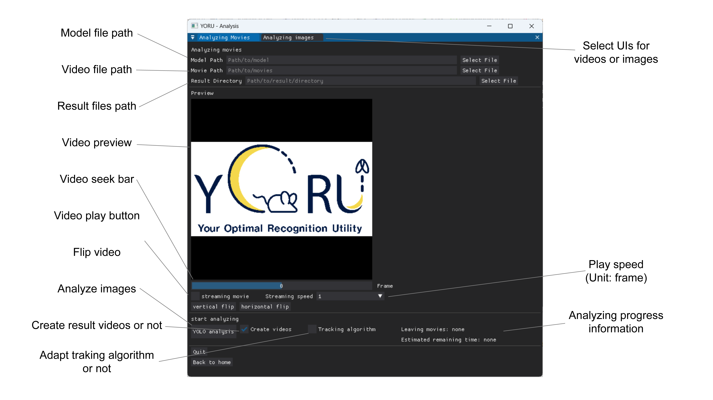

1. Select a model to analyze videos.

2. Select movies.

3. Select a folder to save results.

4. Check the previews.
    
    > When a video is loaded, the first video appears in PREVIEW.

    > Check for flips, etc., and adjust vertical and horizontal flips if any are present.

5. Push the "YOLO analysis" and start an analysis.

    > If you check "Create videos", YORU will save the videos shown in the box.

    > If you check "Tracking algorithm", YORU will save the IDs in the results csv file.

 

## [Next](../04_evaluation.md)

   

## [Previous](../02_training.md)