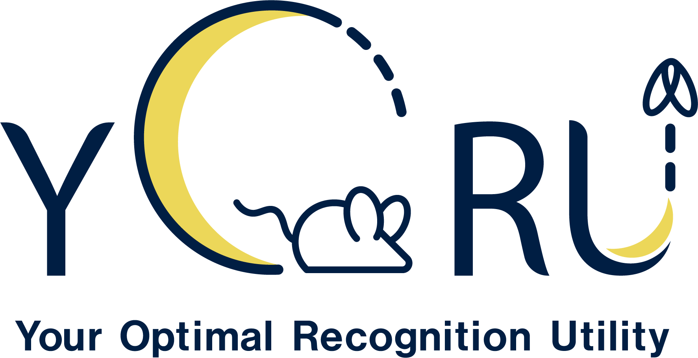

## YORU (Your Optimal Recognition Utility)

<div class="badges" markdown="1">
[](https://github.com/Kamikouchi-lab/YORU/releases/latest)
[](https://github.com/Kamikouchi-lab/YORU/releases)
[](https://www.gnu.org/licenses/agpl-3.0)
[](https://kamikouchi-lab.github.io/YORU_doc/)
[](https://github.com/sponsors/HMYamano)
[](https://github.com/Kamikouchi-lab/YORU)
[](https://github.com/Kamikouchi-lab/YORU/issues)
</div>




“YORU” (Your Optimal Recognition Utility) is an open-source animal behavior detection system using Python. YORU can detect animal behaviors, not only single-animal behaviors but also social behaviors. YORU also provides online/offline analysis and closed-loop manipulation.


["YORU: Animal behavior detection with object-based approach for real-time closed-loop feedback"](https://www.science.org/doi/10.1126/sciadv.adw2109)


## Versions

| Channel | Version | Notes |
|---------|---------|-------|
| **Latest Release** | [v1.1.2](https://github.com/Kamikouchi-lab/YORU/releases/tag/v1.1.2) | Stable release recommended for general use |
| **Latest Beta** | [v2.0.0-beta.2](https://github.com/Kamikouchi-lab/YORU/releases/tag/v2.0.0-beta.2) | Preview of the next major version — may contain bugs |

> To use the beta version, check out the corresponding tag:
> ```
> git checkout v2.0.0-beta.2
> ```
> Beta 2 changes how YORU is launched (no Google Chrome) and removes YOLOv5.
> Read the [Beta Release Notes]({{ site.baseurl }}/beta/) before installing or upgrading.


## Features

- Comprehensive Behavior Detection: Recognizes both single-animal and social behaviors, and allows for user-defined animal appearances using deep learning techniques.

- Online/Offline Analysis: Supports real-time and post-experiment data analysis.

- Closed-Loop Manipulation: Enables interactive experiments with live feedback control.

- User-Friendly Interface: Provide the GUI-based software.

- Customizable: Allows you to customize various hardware manipulations in closed-loop system.

# Quick install (conda)

Follow these steps to install YORU quickly. These steps describe the conda route, which targets Windows (and Linux) with an NVIDIA GPU; on macOS, or if you already use [uv](https://docs.astral.sh/uv/), [Install via uv](#install-via-uv) below is simpler.

> Whichever route you take, YORU needs a **Chromium browser** for its launcher and, for GPU work, an **NVIDIA driver** — but not the CUDA toolkit. On macOS it also needs the **Xcode Command Line Tools**. The [install guide]({{ site.baseurl }}/guides/01-install/) covers all three in detail.

1. Download or clone the YORU project.
    ```
    cd "Path/to/download"
    git clone https://github.com/Kamikouchi-lab/YORU.git 
    ```

2. Install the appropriate GPU driver. The [CUDA toolkit](https://developer.nvidia.com/cuda-toolkit) is not needed — the PyTorch wheels in step 5 carry their own CUDA runtime — so the `cu118` / `cu121` choice there only has to be one your driver supports.

3. Create a virtual environment.

    Use [YORU.yml](https://github.com/Kamikouchi-lab/YORU/blob/main/YORU.yml) file to create a conda environment:
   
     ```
     conda env create -f "Path/to/YORU.yml"
     ```

4. Activate the virtual environment in the command prompt or Anaconda prompt.

     ```
     conda activate yoru
     ```
    
5. Install [Pytorch](https://pytorch.org) corresponding to the CUDA versions.

    - For CUDA==11.8

    ```
    pip install torch==2.4.1 torchvision==0.19.1 torchaudio==2.4.1 --index-url https://download.pytorch.org/whl/cu118
    ```

   - For CUDA==12.1

    ```
    pip install torch==2.4.1 torchvision==0.19.1 torchaudio==2.4.1 --index-url https://download.pytorch.org/whl/cu121
    ```
    

    - (torch, torchvision and torchaudio will be installed.)

6. Run YORU in the command prompt or Anaconda prompt.

    Navigate to the YORU project folder and execute:

    ```
    conda activate yoru
    cd "Path/to/YORU/project/folder"
    python -m yoru
    ```


# Install via uv

The repository ships its own `pyproject.toml` and `uv.lock`, so [uv](https://docs.astral.sh/uv/) builds the whole environment in one step on Windows, Linux and macOS. uv also picks the right PyTorch build for your platform automatically: the CUDA wheels on Windows and Linux, and the MPS-enabled build from PyPI on macOS. Neither a system Python nor conda is needed — uv downloads the Python 3.10 the project asks for.

1. Install uv.

    Windows (PowerShell):

    ```
    winget install --id=astral-sh.uv -e
    ```

    macOS / Linux:

    ```
    curl -LsSf https://astral.sh/uv/install.sh | sh
    ```

2. Clone the repository and build the environment.

    ```
    git clone https://github.com/Kamikouchi-lab/YORU.git
    cd YORU
    uv sync
    ```

3. Run YORU **from the repository root** — the launcher resolves `web/` and `config/` relative to the working directory.

    ```
    uv run yoru
    ```

`uv run python -m yoru` does the same thing. There is no `uv init` step: the project is already initialised, and uv refuses to re-initialise a folder that already has a `pyproject.toml`.

# Compute device

YORU picks its compute device automatically, in this order: CUDA, then Apple MPS, then CPU. Nothing has to be configured for the usual cases, beyond the NVIDIA driver CUDA needs.

To choose the device yourself, set the `YORU_DEVICE` environment variable before launching (`cuda`, `mps`, `cpu`, or a CUDA index such as `0`), or use the device selector in the training GUI:

```
YORU_DEVICE=cpu uv run yoru
```

On Windows, `set YORU_DEVICE=cpu` before the launch command. The variable applies to YOLOv8, YOLO11, RT-DETR and the torchvision detectors; YOLOv5 inference is loaded through `torch.hub`, which always takes CUDA when it is available and the CPU otherwise. If the requested device is unavailable, YORU falls back to the next best one and writes a warning to `~/.yoru/logs/yoru.log` (`%USERPROFILE%\.yoru\logs\yoru.log` on Windows).

# Learn about YORU
- [User guides]({{ site.baseurl }}/guides/01-install/) — for the stable release (v1.1.2)

- [Beta guides]({{ site.baseurl }}/beta-guides/00-overview/) — for v2.0.0-beta.2

- [Step-by-Step Tutorial]({{ site.baseurl }}/tutorial/01-preparation-tutorial/)

- [Testing Guide]({{ site.baseurl }}/devnotes/yoru-test/)

# Requirements

## OS
- Windows 10 or later, with an NVIDIA GPU. This is the primary target, and the only platform tested end to end including the closed-loop hardware.
- Linux, with an NVIDIA GPU and CUDA. It uses the same CUDA wheels as Windows, but has seen much less testing.
- macOS 14 (Sonoma) or later, on Apple Silicon.

## Hardware
- Memory: 16 GB RAM or more
- GPU: NVIDIA GPU with a driver supporting CUDA 12.x, or an Apple Silicon (M-series) Mac, which uses MPS. YORU also runs on the CPU alone, but detection is much slower.

### Development environments
- OS: Windows 11
- CPU: Intel Core i9 (11th)
- GPU: NVIDIA RTX 3080
- Memory: DDR4 32 GB

## Software
- Python 3.10. uv installs it for you; the conda environment file pins it.
- Google Chrome or Chromium, for the launcher window.
- To use a GPU: an NVIDIA driver supporting CUDA 12.x on Windows/Linux, or macOS 14+ on Apple Silicon for MPS. The CUDA toolkit itself is optional.
- On macOS only: the Xcode Command Line Tools, and the Camera / Input Monitoring / Screen Recording permissions.

# Reference
 - Hayato M. Yamanouchi et al. ,YORU: Animal behavior detection with object-based approach for real-time closed-loop feedback.Sci. Adv.12,eadw2109(2026). DOI:10.1126/sciadv.adw2109
 
 - Yamanouchi, H. M., Takeuchi, R. F., Chiba, N., Hashimoto, K., Shimizu, T., Tanaka, R., & Kamikouchi, A. (2024). YORU: social behavior detection based on user-defined animal appearance using deep learning. bioRxiv (p. 2024.11.12.623320). https://doi.org/10.1101/2024.11.12.623320


# License:

AGPL-3.0 License:  YORU is intended for research/academic/personal use only. See the [LICENSE](LICENSE) file for more details.

# Third-Party Libraries and Licenses

This project includes code from the following repositories:

- [LabelImg](https://github.com/HumanSignal/labelImg): Licensed under the MIT License

- [yolov5](https://github.com/ultralytics/yolov5): Licensed under the AGPL-3.0 License
