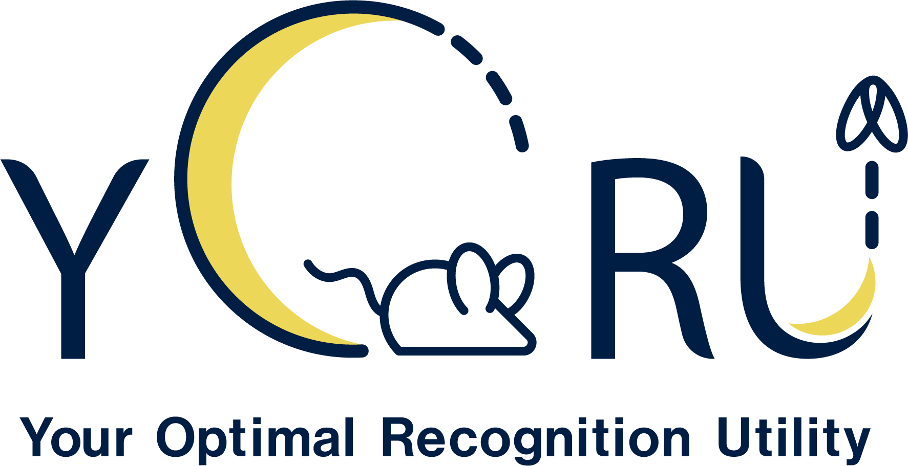

## YORU (Your Optimal Recognition Utility)

<div class="badges" markdown="1">
[](https://github.com/Kamikouchi-lab/YORU/releases/latest)
[](https://github.com/Kamikouchi-lab/YORU/releases)
[](https://www.gnu.org/licenses/agpl-3.0)
[](https://kamikouchi-lab.github.io/YORU_doc/)
[](https://github.com/sponsors/HMYamano)
[](https://github.com/Kamikouchi-lab/YORU)
[](https://github.com/Kamikouchi-lab/YORU/issues)
</div>




“YORU” (Your Optimal Recognition Utility) is an open-source animal behavior detection system using Python. YORU can detect animal behaviors, not only single-animal behaviors but also social behaviors. YORU also provides online/offline analysis and closed-loop manipulation.


["YORU: Animal behavior detection with object-based approach for real-time closed-loop feedback"](https://www.science.org/doi/10.1126/sciadv.adw2109)

<div class="sponsor-cta">
  <p><strong>Support YORU.</strong> YORU is free, open-source research software. If it helps your work, please consider sponsoring its development on GitHub Sponsors.</p>
  
</div>


## Versions

| Channel | Version | Notes |
|---------|---------|-------|
| **Latest Release** | [v1.1.2](https://github.com/Kamikouchi-lab/YORU/releases/tag/v1.1.2) | Stable release recommended for general use |
| **Latest Beta** | [v2.0.0-beta.3](https://github.com/Kamikouchi-lab/YORU/releases/tag/v2.0.0-beta.3) | Preview of the next major version — may contain bugs |

> To use the beta version, check out the corresponding tag:
> ```
> git checkout v2.0.0-beta.3
> ```
> The v2.0 betas launch without Google Chrome and no longer include YOLOv5. Beta 3 adds oriented bounding boxes (OBB) and faster labelling, and moves to Python 3.10, so a Beta 2 conda environment has to be recreated.
> Read the [Beta Release Notes]({{ site.baseurl }}/beta/) before installing or upgrading.

### What's new in v1.1.2

- **macOS and Linux:** the uv environment now builds on Windows, Linux and macOS 14+ (Apple Silicon) from a single lockfile.
- **Automatic compute device:** YORU picks CUDA, then Apple MPS, then the CPU. Override it with `YORU_DEVICE` or the device selector in the Training GUI.
- **More models:** the Training GUI trains YOLOv5, YOLOv8, YOLO11, RT-DETR, Faster R-CNN, Mask R-CNN and SSD.
- **Error logs:** errors are shown on screen and written to `~/.yoru/logs/yoru.log`.
- **No CUDA toolkit needed:** only the NVIDIA driver. The PyTorch wheels carry their own CUDA runtime.

See the [release page](https://github.com/Kamikouchi-lab/YORU/releases/tag/v1.1.2) for the full list.


## Features

- Comprehensive Behavior Detection: Recognizes both single-animal and social behaviors, and allows for user-defined animal appearances using deep learning techniques.

- Online/Offline Analysis: Supports real-time and post-experiment data analysis.

- Closed-Loop Manipulation: Enables interactive experiments with live feedback control.

- User-Friendly Interface: Provide the GUI-based software.

- Customizable: Allows you to customize various hardware manipulations in closed-loop system.

# Quick install

These steps install the stable release (v1.1.2). The [Install guide]({{ site.baseurl }}/guides/01-install/) has the details, including the prerequisites for macOS.

**Before you start**, install:

- **Google Chrome or Chromium.** The v1.1.x launcher opens in it. Microsoft Edge and Safari do not work.
- **An NVIDIA GPU driver** that supports CUDA 12.x, to use a GPU on Windows or Linux. You do not need the CUDA toolkit.

## Install with uv (Windows, Linux, macOS)

1. Install [uv](https://docs.astral.sh/uv/getting-started/installation/).

    Windows (PowerShell):
    ```
    winget install --id=astral-sh.uv -e
    ```

    macOS / Linux:
    ```
    curl -LsSf https://astral.sh/uv/install.sh | sh
    ```

2. Clone the repository and build the environment.

    ```
    git clone https://github.com/Kamikouchi-lab/YORU.git
    cd YORU
    uv sync
    ```

3. Run YORU from the repository folder.

    ```
    uv run yoru
    ```

## Install with conda (Windows, Linux)

1. Download or clone the YORU project.
    ```
    cd "Path/to/download"
    git clone https://github.com/Kamikouchi-lab/YORU.git
    ```

2. Create a virtual environment with the [YORU.yml](https://github.com/Kamikouchi-lab/YORU/blob/main/YORU.yml) file (Python 3.10):

     ```
     conda env create -f "Path/to/YORU.yml"
     ```

3. Activate the virtual environment in the command prompt or Anaconda prompt.

     ```
     conda activate yoru
     ```

4. Install [PyTorch](https://pytorch.org). The `cu118` / `cu121` choice has to be one that your **driver** supports.

    - For CUDA==11.8

    ```
    pip install torch==2.4.1 torchvision==0.19.1 torchaudio==2.4.1 --index-url https://download.pytorch.org/whl/cu118
    ```

   - For CUDA==12.1

    ```
    pip install torch==2.4.1 torchvision==0.19.1 torchaudio==2.4.1 --index-url https://download.pytorch.org/whl/cu121
    ```

5. Run YORU from the YORU project folder.

    ```
    conda activate yoru
    cd "Path/to/YORU/project/folder"
    python -m yoru
    ```


# Learn about YORU
- [User guides]({{ site.baseurl }}/guides/01-install/) — for the stable release (v1.1.2)

- [Beta guides]({{ site.baseurl }}/beta-guides/00-overview/) — for v2.0.0-beta.3

- [Step-by-Step Tutorial]({{ site.baseurl }}/tutorial/01-preparation-tutorial/)

- [Testing Guide]({{ site.baseurl }}/devnotes/yoru-test/)

- [Q and A]({{ site.baseurl }}/troubleshootings/)

# Requirements

## OS
- Windows 10 or later, with an NVIDIA GPU. This is the primary target, and the only platform tested end to end, including the closed-loop hardware.
- Linux, with an NVIDIA GPU. It uses the same CUDA wheels as Windows, but has had much less testing.
- macOS 14 (Sonoma) or later on Apple Silicon, installed with uv. Intel Macs are not supported.

## Hardware
- Memory: 16 GB RAM or more
- GPU: an NVIDIA GPU with a driver that supports CUDA 12.x, or an Apple Silicon (M-series) Mac, which uses MPS. YORU also runs on the CPU alone, but detection is much slower.

## Software
- Python 3.10. uv installs it for you, and the conda environment file pins it.
- Google Chrome or Chromium, for the launcher window (v1.1.x only; the v2.0 betas need no browser).
- On macOS only: the Xcode Command Line Tools, and the Camera / Input Monitoring / Screen Recording permissions.

### Development environments
- OS: Windows 11
- CPU: Intel Core i9 (11th)
- GPU: NVIDIA RTX 3080
- Memory: DDR4 32 GB

# Reference
 - Hayato M. Yamanouchi et al. ,YORU: Animal behavior detection with object-based approach for real-time closed-loop feedback.Sci. Adv.12,eadw2109(2026). DOI:10.1126/sciadv.adw2109
 
 - Yamanouchi, H. M., Takeuchi, R. F., Chiba, N., Hashimoto, K., Shimizu, T., Tanaka, R., & Kamikouchi, A. (2024). YORU: social behavior detection based on user-defined animal appearance using deep learning. bioRxiv (p. 2024.11.12.623320). https://doi.org/10.1101/2024.11.12.623320


# License:

AGPL-3.0 License:  YORU is intended for research/academic/personal use only. See the [LICENSE](LICENSE) file for more details.

# Third-Party Libraries and Licenses

This project includes code from the following repositories:

- [LabelImg](https://github.com/HumanSignal/labelImg): Licensed under the MIT License

- [yolov5](https://github.com/ultralytics/yolov5): Licensed under the AGPL-3.0 License
